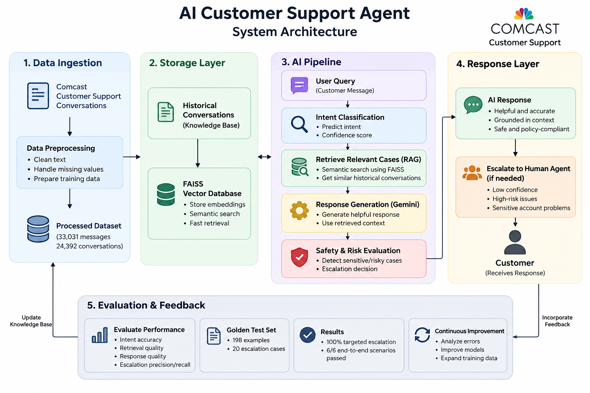

# AI Customer Support Agent for Comcast

An AI-powered customer support agent that analyzes customer messages, identifies their intent, retrieves similar historical support conversations, generates safe and brand-aligned responses, and decides whether the request should be automatically handled or escalated to a human agent.

## Project Overview

This project builds an end-to-end AI customer support system using the Customer Support on Twitter dataset.

The system is designed for Comcast (`@comcastcares`) and combines:

- Hybrid intent classification
- Confidence analysis
- Semantic search using embeddings
- FAISS-based Retrieval-Augmented Generation (RAG)
- LLM-based response generation
- Safety and privacy controls
- Intelligent escalation
- Automated evaluation

## Key Objectives

The system aims to:

1. Reconstruct customer-support conversations from Twitter data.
2. Classify customer requests into support intents.
3. Retrieve historically similar Comcast conversations.
4. Generate helpful and concise support responses.
5. Avoid unsupported claims and unnecessary exposure of sensitive information.
6. Detect situations that require human intervention.
7. Evaluate the system using a dedicated evaluation set and escalation benchmark.

---

## Technology Stack

### Programming Language

- Python 3.x

### Data Processing

- Pandas
- NumPy
- Scikit-learn

### Machine Learning

- TF-IDF
- Logistic Regression
- Hybrid ML + domain-rule classification

### Natural Language Processing

- Sentence Transformers
- `all-MiniLM-L6-v2`

### Retrieval / RAG

- FAISS
- Vector embeddings
- Cosine-similarity-style semantic retrieval using normalized embeddings

### LLM

- Google Gemini
- Gemini-based response generation
- LLM-as-a-Judge evaluation

### Development

- VS Code
- Python Virtual Environment
- Jupyter Notebook

---

## System Architecture



The system follows an end-to-end pipeline:

```text
Customer Message
       ↓
Preprocessing
       ↓
Hybrid Intent Classification
       ↓
Confidence Analysis
       ↓
Historical Case Retrieval (RAG)
       ↓
LLM Response Generation
       ↓
Escalation Detection
       ↓
Final Decision
       ↓
Support Response


Press **Enter twice**, then paste:

```markdown
---

## Intent Taxonomy

The support agent classifies customer messages into 10 predefined intents:

| Intent | Description |
|---|---|
| `BILLING_ISSUE` | Problems or questions related to bills, charges, or incorrect billing |
| `INTERNET_OUTAGE` | Complete loss of internet or service availability |
| `TECHNICAL_ISSUE` | General technical or service-related problems |
| `SLOW_INTERNET` | Slow internet, buffering, or poor connection speed |
| `ACCOUNT_ISSUE` | Problems involving customer accounts or account access |
| `PLAN_CHANGE` | Requests to modify or change an existing service plan |
| `CANCELLATION` | Requests to cancel a Comcast service |
| `PAYMENT_ISSUE` | Problems involving payments, payment status, or payment processing |
| `SERVICE_AVAILABILITY` | Questions about whether Comcast service is available in a particular location |
| `GENERAL_INQUIRY` | General customer questions that do not fit another category |

### Hybrid Classification Strategy

The final intent decision combines machine-learning predictions with domain-specific signals.

The ML classifier uses TF-IDF features with Logistic Regression, while the domain layer uses Comcast-specific keywords and patterns.

This allows the system to use both:

- Statistical language patterns learned from the data
- Explicit domain knowledge about common customer-support issues

---

## Retrieval-Augmented Generation (RAG)

The system uses Retrieval-Augmented Generation to ground customer responses in historical Comcast support conversations.

### Retrieval Pipeline

1. Comcast conversations are converted into searchable documents.
2. Each conversation is converted into a vector embedding using `all-MiniLM-L6-v2`.
3. Embeddings are stored in a FAISS vector index.
4. When a new customer message arrives, its embedding is generated.
5. The system retrieves the most similar historical conversations.
6. The retrieved cases are provided as context to the response-generation layer.

### Vector Database

- Embedding model: `all-MiniLM-L6-v2`
- Embedding dimension: `384`
- Vector database: `FAISS`
- Similarity metric: Inner Product
- Embeddings are normalized before similarity search.
- Top relevant historical conversations are retrieved for each query.

The historical conversations are used as contextual guidance only. The system does not assume that historical account information, outages, prices, refunds, or actions are currently valid.

---

## LLM Response Generation

The system uses Google's Gemini model to generate customer-facing support responses.

The response generator receives:

- Customer message
- Detected intent
- Retrieved historical support cases

The LLM then generates a concise and helpful response while following strict grounding and safety rules.

### Response Generation Principles

The generated response should:

- Directly address the customer's issue
- Be polite and empathetic
- Provide useful next steps
- Remain concise
- Avoid unsupported claims
- Never invent account information
- Never claim that an outage, refund, credit, or account action has occurred without evidence
- Use historical conversations only as contextual examples
- Avoid exposing internal retrieval information

For account-specific or sensitive situations, the system directs the customer toward a secure Comcast support channel instead of requesting sensitive information publicly.

---

## Safety & Privacy

The system includes safety controls to reduce the risk of exposing sensitive customer information or generating unsupported claims.

### Sensitive Information Protection

The agent does not request or expose:

- Passwords
- PINs
- Full payment card numbers
- Authentication codes
- Security answers
- Unnecessary personal information
- Publicly shared account-specific information

For sensitive account verification, customers are directed to a secure Comcast support channel.

### Grounding Protection

Historical support conversations are treated as reference context only.

The system does not assume that historical information represents the customer's current:

- Account status
- Billing amount
- Service status
- Outage status
- Refund or credit
- Completed support action

This helps reduce hallucinations and prevents the model from presenting historical information as current facts.

---

## Escalation & Decision Engine

The system determines whether a customer request should be handled automatically or escalated to a human support agent.

### Risk Signals

The escalation layer checks for:

- Security or privacy concerns
- Highly frustrated customers
- Explicit requests for a human representative

The system also considers intent confidence when the predicted intent falls outside the defined routine support categories.

### Possible Decisions

#### AUTO_HANDLE

The AI handles the request automatically when no significant escalation risk is detected.

#### ESCALATE

The request is routed toward human support when a significant risk signal is detected.

Each escalation decision includes the reason for escalation, making the system's decision explainable.

### Example

```text
Customer:
Someone hacked my Comcast account and accessed my information.

Decision:
ESCALATE

Reason:
Possible security or privacy concern

---

## Evaluation

The system was evaluated across intent classification, retrieval/generation, and escalation behavior.

### Golden Evaluation Set

A golden evaluation set containing **198 customer examples** was created across the supported intent categories.

The evaluation data was reviewed to provide reference intent labels for testing the classifier.

### Intent Classification Evaluation

The intent classifier was evaluated using standard classification metrics:

- Accuracy
- Precision
- Recall
- F1 Score
- Confusion Matrix
- Per-intent performance

The evaluation showed that some categories are more difficult to distinguish because customer-support messages can contain overlapping signals.

### Escalation Evaluation

A targeted benchmark containing **20 manually designed escalation cases** was used to evaluate the risk-rule engine.

Results:

| Metric | Score |
|---|---:|
| Accuracy | 1.00 |
| Precision | 1.00 |
| Recall | 1.00 |
| F1 Score | 1.00 |

The benchmark contained both `AUTO_HANDLE` and `ESCALATE` examples.

### LLM Response Evaluation

Generated responses were designed to be evaluated using an LLM-as-a-judge approach.

The judge evaluates:

- Relevance
- Helpfulness
- Accuracy
- Empathy
- Conciseness
- Safety
- Overall quality
- Intent alignment
- Grounding

If the LLM evaluation API quota is unavailable, the system records the evaluation as unavailable rather than fabricating scores.

---

## Sample End-to-End Output

### Example 1 — Billing Issue

**Customer Message**

> Why is my Comcast bill so high this month?

**Detected Intent**

```text
BILLING_ISSUE

---

## Project Structure

```text
ai-customer-support-agent/
│
├── data/
│   ├── raw/
│   │   └── twcs.csv
│   ├── processed/
│   │   ├── conversations.csv
│   │   ├── brand_conversations.csv
│   │   └── intents.csv
│   └── golden/
│       ├── escalation_test_cases.csv
│       ├── golden_evaluation_set.csv
│       ├── intent_review.csv
│       ├── hybrid_intent_errors.csv
│       └── ml_intent_errors.csv
│
├── notebooks/
│   ├── 01_data_exploration.ipynb
│   ├── 02_brand_selection.ipynb
│   ├── 03_intent_analysis.ipynb
│   └── 04_evaluation_analysis.ipynb
│
├── src/
│   ├── config/
│   │   └── settings.py
│   │
│   ├── data/
│   │   ├── load_data.py
│   │   ├── clean_data.py
│   │   ├── build_conversations.py
│   │   └── sample_data.py
│   │
│   ├── intent/
│   │   ├── taxonomy.py
│   │   ├── classifier.py
│   │   ├── confidence.py
│   │   ├── create_training_data.py
│   │   ├── ml_classifier.py
│   │   └── domain_features.py
│   │
│   ├── retrieval/
│   │   ├── embeddings.py
│   │   ├── vector_store.py
│   │   ├── retriever.py
│   │   └── build_index.py
│   │
│   ├── generation/
│   │   ├── prompts.py
│   │   ├── llm_client.py
│   │   └── response_generator.py
│   │
│   ├── escalation/
│   │   ├── risk_rules.py
│   │   ├── escalation_detector.py
│   │   └── decision.py
│   │
│   ├── evaluation/
│   │   ├── metrics.py
│   │   ├── llm_judge.py
│   │   ├── evaluate_intent.py
│   │   ├── evaluate_replies.py
│   │   ├── evaluate_escalation.py
│   │   ├── evaluate_hybrid_intent.py
│   │   └── test_rag_generation.py
│   │
│   └── pipeline.py
│
├── docs/
│   └── architecture.png
│
├── reports/
│   └── results/
│
├── .env
├── .gitignore
├── requirements.txt
└── README.md


---

## Installation

### 1. Clone the Repository

```bash
git clone <your-github-repository-url>
cd ai-customer-support-agent


---

## Dataset

This project uses the **Customer Support on Twitter** dataset, which contains millions of customer-support tweets and brand responses.

### Dataset Information

- Dataset: Customer Support on Twitter
- Total tweets: 2.8M+
- Selected brand: Comcast
- Comcast Twitter author ID: `comcastcares`
- Comcast tweets extracted: 33,031
- Unique reconstructed conversations: 24,392

### Conversation Reconstruction

The original dataset contains individual tweets and reply relationships.

The project reconstructs conversations using:

- `tweet_id`
- `response_tweet_id`
- `in_response_to_tweet_id`
- `author_id`
- `inbound`
- `created_at`

This allows the system to transform individual tweets into conversation-level historical cases suitable for retrieval and analysis.

### Data Processing

The processing pipeline:

```text
Raw Twitter Dataset
        ↓
Comcast Brand Filtering
        ↓
Tweet Cleaning
        ↓
Reply Relationship Reconstruction
        ↓
Conversation Construction
        ↓
Intent Analysis
        ↓
RAG Knowledge Base


---

## End-to-End Workflow

The complete system follows this workflow:

```text
                    Customer Message
                           │
                           ▼
                  ┌─────────────────┐
                  │ Intent Detection │
                  └────────┬────────┘
                           │
                           ▼
                  ┌─────────────────┐
                  │   Confidence    │
                  │    Analysis     │
                  └────────┬────────┘
                           │
                           ▼
                  ┌─────────────────┐
                  │  FAISS RAG      │
                  │ Case Retrieval  │
                  └────────┬────────┘
                           │
                           ▼
                  ┌─────────────────┐
                  │ Gemini Response │
                  │   Generation    │
                  └────────┬────────┘
                           │
                           ▼
                  ┌─────────────────┐
                  │    Escalation   │
                  │     Detection   │
                  └────────┬────────┘
                           │
                           ▼
                  ┌─────────────────┐
                  │ Final Decision  │
                  │ AUTO / ESCALATE │
                  └─────────────────┘

---

## Example Scenarios

### 1. Billing Issue

**Input**

```text
I was charged twice on my Comcast bill.

---

## Testing

The project includes tests for the major components of the AI support agent.

### End-to-End Pipeline Testing

The complete pipeline was tested using multiple customer scenarios covering:

- Billing issues
- Internet outages
- Slow internet
- Account security concerns
- Human-agent requests
- Service cancellation

The tested scenarios successfully demonstrated both:

```text
AUTO_HANDLE

---

## Results Summary

The system was tested across the major components of the customer support pipeline.

| Component | Result |
|---|---|
| Dataset Processing | 2.8M+ tweets processed |
| Comcast Messages | 33,031 |
| Reconstructed Conversations | 24,392 |
| RAG Vector Index | 24,392 conversation vectors |
| Embedding Dimension | 384 |
| Golden Evaluation Set | 198 examples |
| Escalation Benchmark | 20 test cases |
| Escalation Accuracy | 100% |
| End-to-End Scenarios Tested | 6 |
| End-to-End Scenarios Passed | 6/6 |

### Key Observations

- Historical Comcast conversations can be effectively used for semantic retrieval.
- The RAG system retrieves relevant historical cases for new customer messages.
- The hybrid intent classifier combines ML predictions with domain-specific signals.
- Security and human-agent requests are correctly identified as escalation cases in the targeted benchmark.
- Safety rules prevent the response generator from requesting sensitive information publicly.
- The system is designed to avoid treating historical support conversations as current facts.

### Important Evaluation Note

The escalation score represents a **targeted risk-rule benchmark** of 20 manually designed cases.

The intent-classification evaluation set contains reviewed labels and may include ambiguous or noisy examples. Therefore, classification metrics should be interpreted as an evaluation of the current prototype rather than a definitive measure of production-level intent accuracy.

LLM-as-a-judge evaluation was implemented, but API quota limitations may prevent obtaining judge scores during some runs. In such cases, the system records the evaluation as unavailable rather than generating fabricated scores.

---

## Limitations & Future Improvements

Although the current system demonstrates an end-to-end AI customer support workflow, there are several areas that can be improved.

### Current Limitations

- Intent classification can struggle with ambiguous customer messages.
- Some customer-support messages contain multiple issues, making single-intent classification difficult.
- The reviewed evaluation labels may contain some ambiguity or label noise.
- Historical conversations may contain outdated information and therefore cannot be treated as current facts.
- LLM response evaluation depends on API availability and quota.
- The current escalation engine is primarily rule-based.
- The system currently supports one selected brand: Comcast.

### Future Improvements

#### 1. Better Intent Classification

Use a larger, independently labeled training dataset and fine-tune a transformer-based classifier for improved intent recognition.

#### 2. Multi-Intent Detection

Allow the system to identify multiple issues within a single customer message.

For example:

```text
My internet is slow and I was also charged twice this month.


---

## Security Considerations

Security and privacy are important because customer-support conversations may contain sensitive information.

The system follows these principles:

- API keys are stored in environment variables.
- `.env` is excluded from Git using `.gitignore`.
- Sensitive customer information should not be requested publicly.
- Passwords, PINs, payment-card numbers, authentication codes, and security answers are not requested.
- Account-specific investigation is directed toward secure support channels.
- Historical conversations are used only as contextual references.
- Internal conversation IDs, similarity scores, and retrieval details are not exposed to customers.
- The system avoids making unsupported claims about customer accounts, payments, refunds, credits, outages, or completed actions.

### Secret Management

The Gemini API key should be stored locally in:

```text
.env

---

## Conclusion

This project demonstrates an end-to-end AI-powered customer support agent built using real customer-support conversation data.

The system combines:

- Intent classification
- Confidence analysis
- Retrieval-Augmented Generation (RAG)
- FAISS vector search
- Gemini-based response generation
- Safety and privacy controls
- Risk-based escalation
- Automated evaluation

The architecture is designed to provide helpful, grounded, and safe customer-support responses while identifying situations that require human intervention.

The project also demonstrates how traditional machine-learning techniques, domain-specific rules, semantic retrieval, and generative AI can work together to build a practical customer-support system.